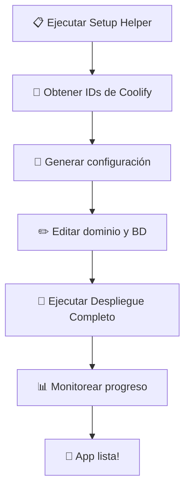

# 🚀 Despliegue Automático en Coolify - MUEBLERIA LA ECONOMICA

## 📋 Scripts Disponibles

### 1️⃣ **Setup Helper** (Usar primero)
```bash
./coolify-setup-helper.sh
```
**¿Qué hace?**
- 🔍 Se conecta a tu Coolify
- 📡 Lista todos los servidores disponibles
- 🎯 Muestra los destinos de cada servidor
- 📱 Lista aplicaciones existentes
- 💾 Genera configuración automática

### 2️⃣ **Despliegue Completo** (Recomendado)
```bash
./coolify-deploy.sh
```
**¿Qué hace?**
- 🛠️ Configuración interactiva paso a paso
- 🔐 Genera secrets automáticamente
- 🚀 Crea la aplicación en Coolify
- ⚙️ Configura variables de entorno
- 🎯 Inicia el despliegue
- 📊 Monitorea el progreso

### 3️⃣ **One-Click Deploy** (Para expertos)
```bash
# Editar variables en el script primero
./coolify-one-click.sh
```
**¿Qué hace?**
- ⚡ Despliegue ultra-rápido
- 🎯 Un comando, cero preguntas
- 🚀 Ideal para CI/CD

---

## 📊 Flujo de Trabajo Recomendado



---

## 🔧 Configuración Requerida

### **Datos de Coolify**
- `COOLIFY_URL`: https://coolify.tu-dominio.com
- `COOLIFY_TOKEN`: Token de API (desde Settings > API Tokens)
- `SERVER_ID`: ID del servidor (obtenido con setup-helper)
- `DESTINATION_ID`: ID del destino (obtenido con setup-helper)

### **Datos de tu Aplicación**
- `APP_DOMAIN`: dominio donde estará tu app
- `DATABASE_URL`: conexión a PostgreSQL

---

## 🎯 Opciones de Despliegue

### **Opción A: Guiado (Para principiantes)**
```bash
# 1. Obtener configuración
./coolify-setup-helper.sh

# 2. Editar el archivo generado
nano coolify-auto-config.env

# 3. Desplegar automáticamente  
./coolify-deploy.sh
```

### **Opción B: API Manual**
```bash
# Ver la guía completa
cat coolify-api-guide.md

# O usar comandos curl directamente
curl -X POST "https://coolify.com/api/v1/applications" \
  -H "Authorization: Bearer TOKEN" \
  -d '{"name": "muebleria-la-economica", ...}'
```

### **Opción C: Ultra-Rápido**
```bash
# Editar coolify-one-click.sh con tu configuración
nano coolify-one-click.sh

# Desplegar en una línea
./coolify-one-click.sh
```

---

## 🔐 Variables de Entorno Auto-Configuradas

El script configurará automáticamente:

```env
NODE_ENV=production
PORT=3000
NEXTAUTH_URL=https://tu-dominio.com
NEXTAUTH_SECRET=auto-generado-seguro
JWT_SECRET=auto-generado-seguro
DATABASE_URL=tu-conexión-postgresql
```

---

## 📊 Monitoreo del Despliegue

### **Desde el Script**
- ✅ Progreso en tiempo real
- ✅ Estado de la aplicación
- ✅ Enlaces directos al panel

### **Desde Coolify Panel**
- 📊 Logs detallados de build
- 🔧 Configuración de la app
- 📈 Métricas de rendimiento
- 🔄 Historial de despliegues

---

## 🚨 Solución de Problemas

### **Error: "Could not connect"**
```bash
# Verificar conectividad
curl -H "Authorization: Bearer TOKEN" \
  "https://tu-coolify.com/api/v1/ping"
```

### **Error: "Invalid server/destination ID"**
```bash
# Re-ejecutar setup helper
./coolify-setup-helper.sh
```

### **Error: "Deployment failed"**
- 📋 Revisar logs en panel de Coolify
- 🔍 Verificar variables de entorno
- 🗄️ Confirmar acceso a base de datos

---

## 🎉 Resultado Final

Una vez completado el despliegue:

- ✅ **Aplicación funcionando** en tu dominio
- ✅ **Base de datos conectada** y migrada
- ✅ **SSL automático** configurado
- ✅ **Monitoreo activo** en Coolify
- ✅ **Auto-redeploy** en git push (opcional)

---

## 🔗 Enlaces Útiles

- **📚 Guía API completa**: `coolify-api-guide.md`
- **🔧 Documentación Coolify**: https://coolify.io/docs
- **📱 Tu aplicación**: Configurada automáticamente
- **🛠️ Panel Coolify**: Enlace generado por el script

---

## ⚡ Comandos Rápidos

```bash
# Setup completo (una vez)
./coolify-setup-helper.sh && ./coolify-deploy.sh

# Re-desplegar (después de cambios)
curl -X POST -H "Authorization: Bearer TOKEN" \
  "https://coolify.com/api/v1/applications/{UUID}/deploy"

# Ver estado
curl -H "Authorization: Bearer TOKEN" \
  "https://coolify.com/api/v1/applications/{UUID}/status"
```

---

**🎯 Con estos scripts, tu aplicación estará desplegada en Coolify en menos de 5 minutos!**
