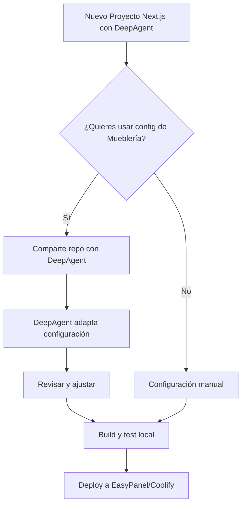

# 🤖 Guía de Importación para Proyectos DeepAgent

Esta guía te muestra cómo reutilizar la configuración de deployment de Mueblería La Económica en otros proyectos de Next.js que estés desarrollando con DeepAgent.

## 🎯 Objetivo

Aprovechar toda la configuración de Docker, EasyPanel y Coolify que ya funciona en Mueblería La Económica para tus nuevos proyectos Next.js.

## 📋 Métodos de Importación

### Método 1: Importación Automática con DeepAgent (Recomendado)

Este es el método más simple. En tu nueva conversación con DeepAgent, simplemente escribe:

```
Tengo un proyecto Next.js anterior con configuración de deployment lista.

Repositorio origen: https://github.com/[tu-usuario]/muebleria_la_economica

Por favor:
1. Revisa estos archivos del repositorio:
   - Dockerfile
   - docker-compose.yml
   - start.sh
   - app/next.config.js (configuración standalone)
   - EASYPANEL-COMPLETE-GUIDE.md

2. Adapta esta configuración a mi nuevo proyecto que está en /home/ubuntu/[nuevo-proyecto]

3. Actualiza los nombres, puertos y dominios según mi nuevo proyecto:
   - Nombre del proyecto: [nombre]
   - Dominio: [dominio.com]
   - Puerto: [puerto]
```

**Ventajas:**
- ✅ DeepAgent adapta automáticamente la configuración
- ✅ Detecta las diferencias en la estructura del proyecto
- ✅ Actualiza todas las referencias correctamente
- ✅ Te avisa si hay incompatibilidades

---

### Método 2: Script de Importación Automática

Usa el script que he creado para copiar y adaptar automáticamente:

```bash
cd /home/ubuntu/muebleria_la_economica
chmod +x import-to-new-project.sh
./import-to-new-project.sh
```

El script te pedirá:
- 📁 Ruta del nuevo proyecto
- 📝 Nombre del nuevo proyecto
- 🌐 Dominio
- 🔢 Puerto

Y automáticamente:
1. ✅ Crea un backup del proyecto destino
2. ✅ Copia todos los archivos necesarios
3. ✅ Adapta nombres, puertos y dominios
4. ✅ Crea documentación de migración
5. ✅ Te indica los pasos siguientes

---

### Método 3: Importación Manual (Para control total)

Si prefieres hacerlo manualmente:

#### 3.1. Archivos a Copiar

```bash
# Crear variable con la ruta del nuevo proyecto
NEW_PROJECT="/home/ubuntu/mi-nuevo-proyecto"

# Copiar archivos de deployment
cp /home/ubuntu/muebleria_la_economica/Dockerfile $NEW_PROJECT/
cp /home/ubuntu/muebleria_la_economica/docker-compose.yml $NEW_PROJECT/
cp /home/ubuntu/muebleria_la_economica/start.sh $NEW_PROJECT/
chmod +x $NEW_PROJECT/start.sh

# Copiar documentación
cp /home/ubuntu/muebleria_la_economica/README-DOCKER.md $NEW_PROJECT/
cp /home/ubuntu/muebleria_la_economica/EASYPANEL-COMPLETE-GUIDE.md $NEW_PROJECT/
```

#### 3.2. Adaptaciones Necesarias

##### A. Dockerfile
Busca y reemplaza:
- `muebleria_la_economica` → `[nombre-tu-proyecto]`
- Verifica las rutas según tu estructura

##### B. docker-compose.yml
Actualiza:
```yaml
services:
  app:
    container_name: tu-proyecto-app  # Cambiar nombre
    ports:
      - "3000:3000"  # Cambiar puerto si es necesario
    environment:
      NEXTAUTH_URL: "https://tu-dominio.com"  # Cambiar dominio
```

##### C. next.config.js
Asegúrate de tener:
```javascript
const path = require('path');

module.exports = {
  output: 'standalone',
  outputFileTracingRoot: path.join(__dirname, '../'),
  // ... tu configuración
};
```

##### D. .env
Crea tu archivo `.env` basado en `.env.example`:
```bash
cp .env.example .env
nano .env
```

---

## 🔍 Verificación Post-Importación

Después de importar, verifica:

### 1. Estructura de Archivos
```bash
cd [tu-nuevo-proyecto]
ls -la

# Debes ver:
# ✅ Dockerfile
# ✅ docker-compose.yml
# ✅ start.sh
# ✅ .env
# ✅ app/next.config.js
```

### 2. Configuración Next.js
```bash
cd app
cat next.config.js | grep -E "(output|outputFileTracingRoot)"

# Debe mostrar:
# output: 'standalone',
# outputFileTracingRoot: path.join(__dirname, '../'),
```

### 3. Variables de Entorno
```bash
cat .env

# Verifica que tengas al menos:
# ✅ DATABASE_URL
# ✅ NEXTAUTH_URL
# ✅ NEXTAUTH_SECRET
```

### 4. Test de Build
```bash
docker-compose build

# Debe completar sin errores
```

---

## 🚀 Deployment en el Nuevo Proyecto

Una vez importado y verificado:

### Opción 1: EasyPanel
1. Ve a tu panel de EasyPanel
2. Crea un nuevo proyecto
3. Conecta el repositorio
4. Sigue `EASYPANEL-COMPLETE-GUIDE.md`

### Opción 2: Coolify
```bash
# Si tienes el script
./deploy-coolify.sh

# O sigue README-DOCKER.md
```

### Opción 3: Docker Local
```bash
docker-compose up -d
docker-compose logs -f
```

---

## 🛠️ Troubleshooting Común

### Error: "Module not found: 'next'"
```bash
# Asegúrate de que el Dockerfile copie package.json
# y ejecute npm install
```

### Error: "Prisma client not found"
```bash
# Verifica que el Dockerfile incluya:
RUN npx prisma generate
```

### Error: "Cannot find module '/app/server.js'"
```bash
# Verifica que next.config.js tenga:
output: 'standalone',
outputFileTracingRoot: path.join(__dirname, '../'),
```

### Puerto ya en uso
```bash
# Cambia el puerto en docker-compose.yml:
ports:
  - "3001:3000"  # Usa 3001 en lugar de 3000
```

---

## 💡 Mejores Prácticas

### 1. Usa Git desde el principio
```bash
cd [nuevo-proyecto]
git init
git add .
git commit -m "Initial commit with deployment config"
```

### 2. Mantén las versiones sincronizadas
Si actualizas la configuración en un proyecto, documenta los cambios para replicarlos en otros.

### 3. Centraliza la configuración común
Considera crear un repositorio de "templates" con:
- Dockerfile base
- docker-compose.yml base
- Scripts comunes
- Documentación estándar

### 4. Automatiza con scripts
Crea un script `update-from-template.sh` que sincronice cambios del template a tus proyectos.

---

## 📚 Recursos de Referencia

- **Proyecto Original:** `/home/ubuntu/muebleria_la_economica`
- **Documentación Docker:** `README-DOCKER.md`
- **Guía EasyPanel:** `EASYPANEL-COMPLETE-GUIDE.md`
- **Fix Críticos:** `CRITICAL-FIX-STANDALONE-STRUCTURE.md`

---

## 🎓 Flujo de Trabajo Recomendado



---

## 🆘 Soporte

Si encuentras problemas durante la importación:

1. **Revisa los logs:**
   ```bash
   docker-compose logs -f
   ```

2. **Verifica la estructura:**
   ```bash
   docker exec -it [container-name] ls -la /app
   ```

3. **Consulta con DeepAgent:**
   ```
   Importé la configuración de Mueblería La Económica pero tengo este error:
   [pega el error]
   
   Mi proyecto está en: /home/ubuntu/[proyecto]
   ```

4. **Revisa la documentación original:**
   - CRITICAL-FIX-STANDALONE-STRUCTURE.md
   - TRAEFIK-NO-AVAILABLE-SERVER-FIX.md
   - EASYPANEL-SUCCESS-FINAL.md

---

## 🎉 Checklist Final

Antes de considerar la importación completa:

- [ ] ✅ Dockerfile copiado y adaptado
- [ ] ✅ docker-compose.yml configurado
- [ ] ✅ start.sh ejecutable
- [ ] ✅ next.config.js con output: 'standalone'
- [ ] ✅ .env creado y configurado
- [ ] ✅ Build local exitoso
- [ ] ✅ Container ejecutándose
- [ ] ✅ Health check respondiendo
- [ ] ✅ Aplicación accesible
- [ ] ✅ Base de datos conectada
- [ ] ✅ Autenticación funcionando

---

## 📖 Ejemplo Completo

Aquí un ejemplo real de importación:

```bash
# 1. Ejecutar script de importación
cd /home/ubuntu/muebleria_la_economica
./import-to-new-project.sh

# Responder prompts:
# Ruta: /home/ubuntu/mi-tienda-online
# Nombre: mi-tienda-online
# Dominio: tienda.miempresa.com
# Puerto: 3000

# 2. Ir al nuevo proyecto
cd /home/ubuntu/mi-tienda-online

# 3. Configurar variables
cp .env.example .env
nano .env

# 4. Actualizar next.config.js
nano app/next.config.js
# Agregar: output: 'standalone'

# 5. Build y test
docker-compose build
docker-compose up -d

# 6. Verificar
curl http://localhost:3000/api/health

# 7. Push a GitHub
git add .
git commit -m "Add deployment config from muebleria"
git push

# 8. Deploy en EasyPanel
# Seguir EASYPANEL-COMPLETE-GUIDE.md
```


